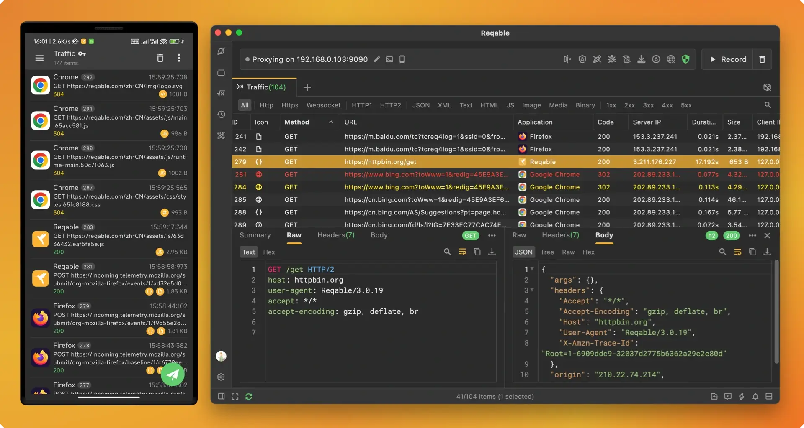
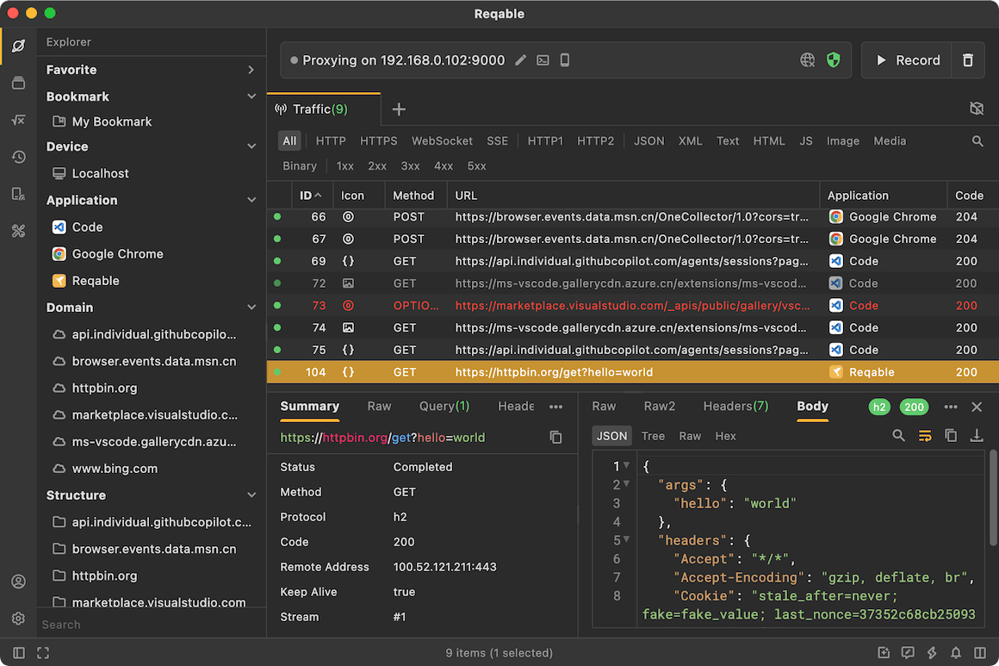
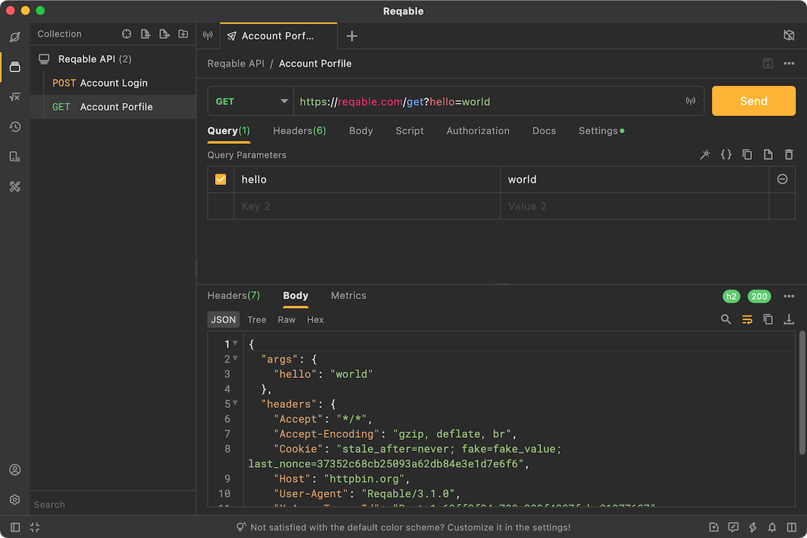
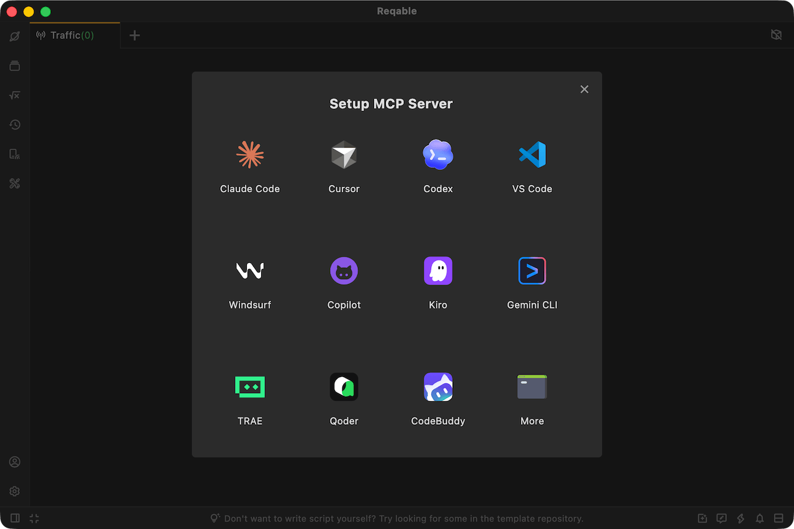
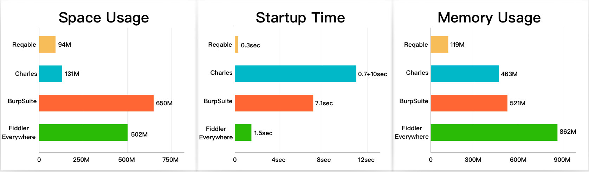
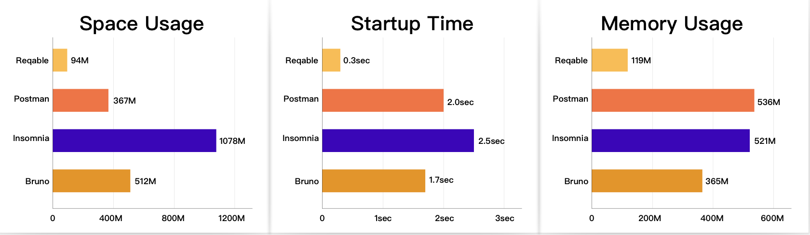
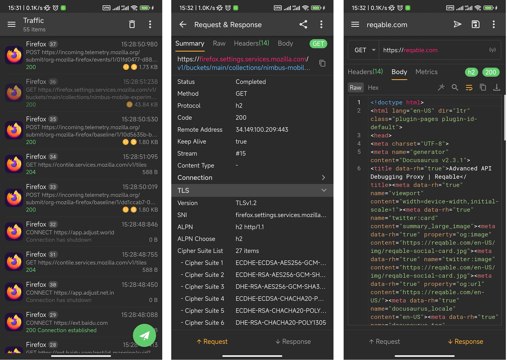

# Reqable

⚠️ **Note: Reqable is not an open-source project. This repository is used solely for issue tracking, feature requests, and user feedback.**

[Reqable](https://reqable.com/) is a next-generation, all-in-one API debugging and testing platform. It delivers cross-platform availability, a no-login-required architecture, a lightweight footprint, high throughput, and an ad-free experience. Reqable is built to streamline API workflows for developers and QA engineers alike, with support for five major platforms: `Windows`, `macOS`, `Linux`, `Android`, and `iOS`.

Reqable combines an API traffic capture tool with a full-featured API testing client in a single, deeply integrated environment — enabling seamless capture-and-test workflows and replacing multiple standalone tools.

The majority of Reqable's features are available free of charge with no time-limited trial. The Community edition covers the needs of most individual developers; power users and teams may benefit from upgrading to the Premium tier for advanced capabilities.

Visit our official website: https://reqable.com

# API Debugging

Reqable employs a classic MITM (Man-in-the-Middle) strategy to intercept HTTP(S) traffic. On desktop platforms, it captures traffic via system-level proxy configuration; on mobile, it leverages a local VPN. Captured traffic can be inspected and manipulated through a rich set of debugging primitives: request replay, inline editing, breakpoints, URL rewriting, custom scripting, and more.

# API Testing

Reqable provides a full-featured API client for composing, sending, and organizing `HTTP`, `WebSocket`, `SSE`, and `gRPC` (coming soon) requests. It includes API collections with folder-based organization, environment variables with scoped resolution, built-in API documentation authoring, and cloud synchronization across devices.

# MCP Support

Reqable ships with a built-in MCP (Model Context Protocol) server, enabling AI assistants such as Claude and GitHub Copilot to interact directly with Reqable. This unlocks AI-driven workflows for API debugging, traffic inspection, rule authoring, and automated testing.

The MCP server implementation is fully open source. See the [MCP Server repository](https://github.com/reqable/reqable-mcp-server) for details.

# Extreme Performance

Reqable is engineered with Flutter and C++, deliberately avoiding an embedded browser runtime. This architectural choice strengthens security by reducing the attack surface while yielding substantial performance gains over Electron-based alternatives.

- Millisecond-level cold-start time.
- Installation footprint under 100 MB.
- Typical memory consumption under 300 MB during active use.

Packet capture performance benchmarks

API client performance benchmarks

> Benchmarks were conducted on an Apple MacBook Pro with the M5 chip. On lower-specification hardware, Reqable's performance delta is even more pronounced.

# Mobile App

The mobile edition maintains feature parity with the desktop version, offering both API debugging and API testing capabilities on the go. It supports adding a desktop peer via QR code scanning, enabling mobile traffic to be forwarded to the desktop for deeper inspection and manipulation.

With an optional account login, cloud synchronization can be enabled to automatically replicate data across all connected devices.

> Breakpoint, rewrite, and scripting features are currently unavailable on mobile platforms due to platform-level security policies.

# Installation

| Platform | Architecture | Format | Download & Install | Notes |
| ---- | ---- | ---- | ---- | ---- |
| **Windows** | x86_64 | exe | [Download](https://app.reqable.com/download?platform=windows&arch=x86_64&ext=exe&locale=en-US) | Installer version (recommended), supports `Windows 7+`. |
| **Windows** | x86_64 | zip | [Download](https://app.reqable.com/download?platform=windows&arch=x86_64&ext=zip&locale=en-US) | Portable version, supports `Windows 7+`. |
| **Mac** | universal | - | brew install reqable | Requires macOS `11.0` or later. |
| **Mac** | Intel Chip | dmg | [Download](https://app.reqable.com/download?platform=macos&arch=x86_64&ext=dmg&locale=en-US) | Intel chip, requires macOS `11.0` or later. |
| **Mac** | Apple Silicon | dmg | [Download](https://app.reqable.com/download?platform=macos&arch=arm64&ext=dmg&locale=en-US) | M-series chip, requires macOS `11.0` or later. |
| **Linux** | x86_64 | deb | [Download](https://app.reqable.com/download?platform=linux&arch=x86_64&ext=deb&locale=en-US) | Supports `Ubuntu`, `Debian`, and other distributions. Requires `GTK 3.0`. |
| **Linux** | x86_64 | AppImage | [Download](https://app.reqable.com/download?platform=linux&arch=x86_64&ext=AppImage&locale=en-US) | Supports `Ubuntu`, `Debian`, and other distributions. Requires `GTK 3.0`. |
| **Android** | universal | - | [Google Play](https://play.google.com/store/apps/details?id=com.reqable.android) | Requires `Android 5.0` or later. |
| **Android** | arm64-v8a | apk | [Download](https://app.reqable.com/download?platform=android&arch=arm64&ext=apk&locale=en-US) | Requires `Android 5.0` or later. |
| **Android** | armeabi-v7a | apk | [Download](https://app.reqable.com/download?platform=android&arch=arm&ext=apk&locale=en-US) | Requires `Android 5.0` or later. |
| **Android** | x86_64 | apk | [Download](https://app.reqable.com/download?platform=android&arch=x86_64&ext=apk&locale=en-US) | Requires `Android 5.0` or later. |
| **iOS** | arm64 | - | [App Store](https://apps.apple.com/cn/app/id6473166828) | Requires `iOS 13.0` or later. |

## Documentation
https://reqable.com/en-US/docs/introduction

## Acknowledgements
- [leanflutter](https://github.com/leanflutter)
- [highlightjs](https://github.com/highlightjs/highlight.js)
