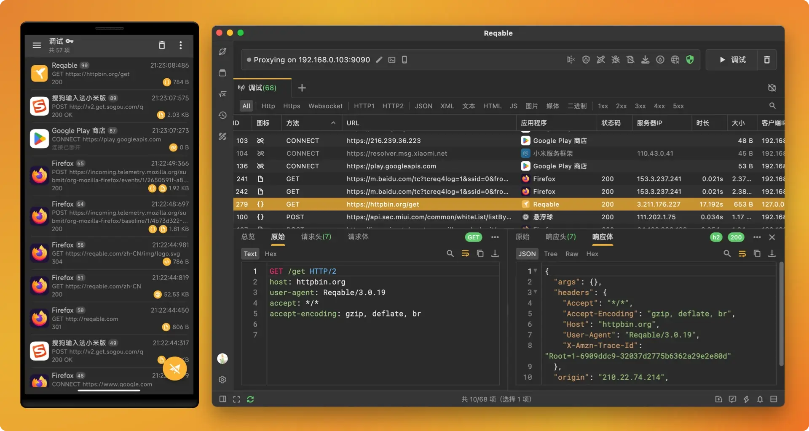
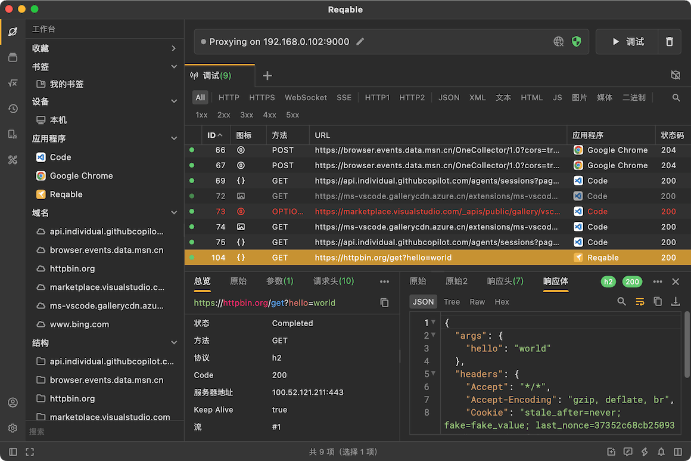
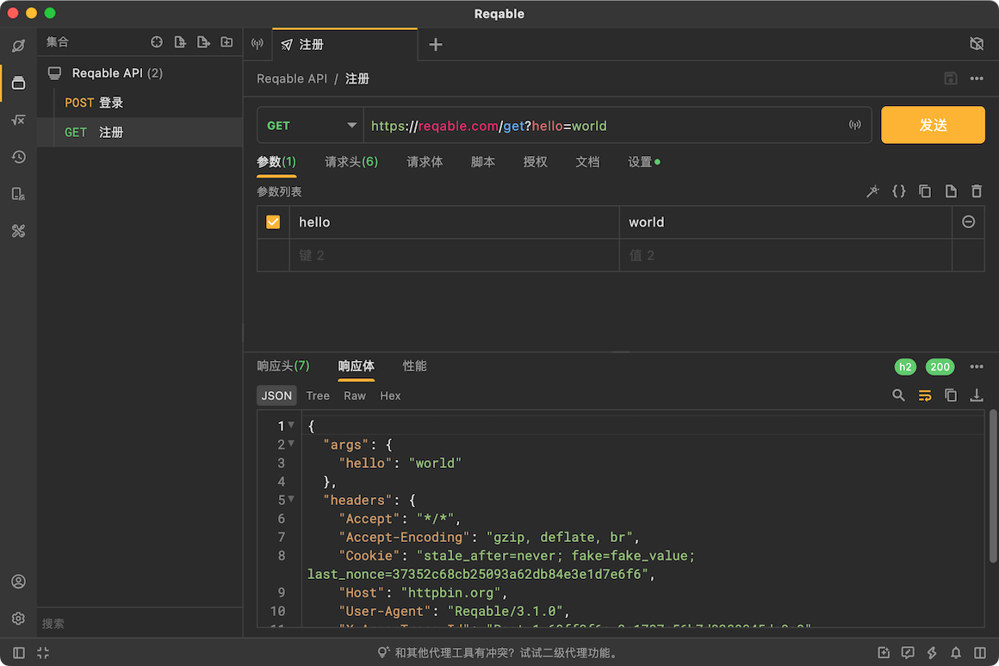
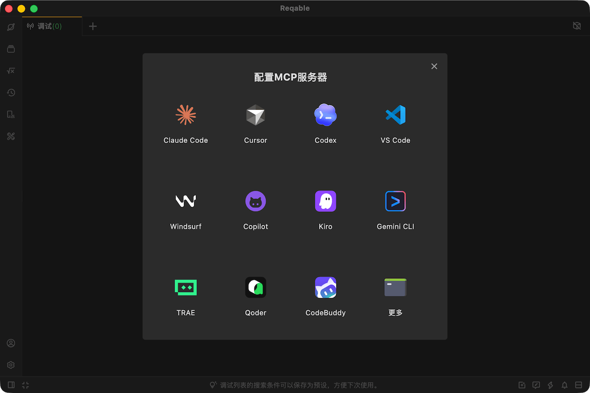
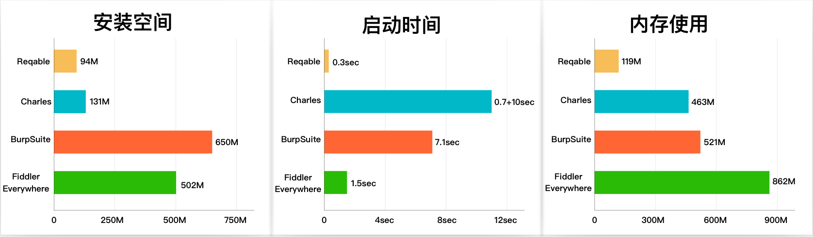
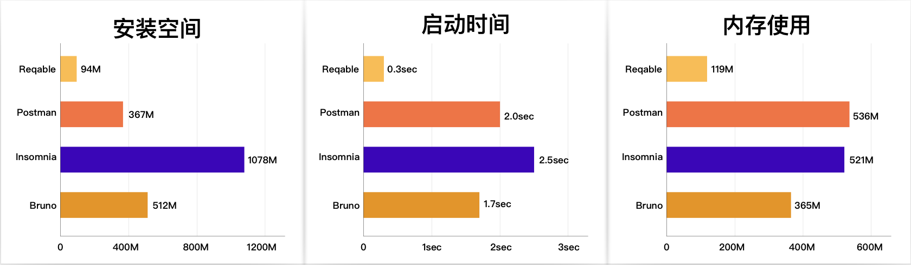
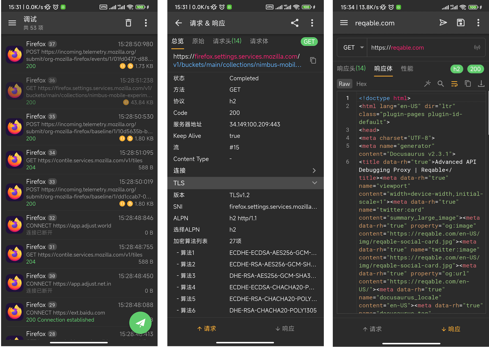

# Reqable

⚠️ **注意：Reqable是非开源项目，本仓库仅用来管理需求和用户反馈。**

[Reqable](https://reqable.com/) 是新一代API调试 + API测试一站化解决方案。Reqable具有全平台、免登录、轻量级、高性能、无广告等优点，理念是让API更快更简单，助力程序开发和测试人员提高生产力！现已支持 `Windows`、`Mac`、`Linux`、`Android` 和 `iOS` 五大平台。

Reqable = API抓包工具 + API测试工具，两者深度整合，抓测一体，操作简单，一个工具顶多个工具。

Reqable 绝大多数功能均可免费使用，没有试用期限，社区版本适合轻度使用者；如果你是功能重度使用者，可能需要购买我们的高级会员。

欢迎访问我们的官方网站：https://reqable.com

# API调试

Reqable采用经典的MITM（中间人）方式对HTTP(S)请求进行抓包，在桌面端使用系统代理的方式拦截流量，在移动端则使用VPN的方式拦截流量。Reqable支持对抓包数据进行调试操作，例如重放、编辑、断点、重写、脚本等。

# API测试

Reqable可以编辑、发送和管理 `HTTP`、`WebSocket`、`SSE` 和 `GRPC`（即将上线）请求，支持API集合，环境变量，文档管理和云同步等功能。

# MCP支持

Reqable提供了内置MCP服务器，你可以将 AI助手（如 Claude、Copilot）与 Reqable 连接起来，从而实现AI驱动的接口调试、流量分析、规则创建等功能。

MCP服务器代码我们是完全开源的，详见 [MCP Server](https://github.com/reqable/reqable-mcp-server)。

# 极致性能

Reqable基于Flutter和C++开发，拒绝内置浏览器，不仅安全性高，相比同类产品还具有极大的性能优势。

- 速度快，毫秒级启动。
- 安装空间小，不足100M。
- 内存占用低，日常低于300M。

抓包工具性能指标

接口工具性能指标

> 以上数据是在苹果最新的MacBook Pro M5设备上的测试结果，在硬件性能较差的设备上，Reqable的性能优势更加明显。

# 移动端版本

移动端和桌面端功能基本保持一致，同时支持API调试和API测试。同时，支持手机扫码添加电脑设备，将手机流量转发到电脑端进行操作。

登录后启用云端数据存储，可以在不同设备之间自动同步数据。

> 断点、重写和脚本功能担心引起滥用暂未上线。

# 安装

|  平台 | 架构 | 格式 | 下载&安装  | 说明  |
| ----  | ----  | ----  | ----  | ----  |
| **Windows** | x86_64 | exe | [下载](https://app.reqable.com/download?platform=windows&arch=x86_64&ext=exe&locale=zh-CN) | 安装版本（建议），支持 `Windows 7+`。 |
| **Windows** | x86_64 | zip | [下载](https://app.reqable.com/download?platform=windows&arch=x86_64&ext=zip&locale=zh-CN) | 免安装版本，支持 `Windows 7+`。 |
| **Mac** | universal | - |  brew install reqable | 要求系统 `11.0` 及以上版本。 |
| **Mac** | Intel Chip | dmg | [下载](https://app.reqable.com/download?platform=macos&arch=x86_64&ext=dmg&locale=zh-CN) | Intel芯片，要求系统 `11.0` 及以上版本。 |
| **Mac** | Apple Silicon |  dmg | [下载](https://app.reqable.com/download?platform=macos&arch=arm64&ext=dmg&locale=zh-CN) | M系列芯片，要求系统 `11.0` 及以上版本。 |
| **Linux** | x86_64 | deb | [下载](https://app.reqable.com/download?platform=linux&arch=x86_64&ext=deb&locale=zh-CN) | 支持 `Ubuntu` 和 `Debian` 等发行版本，并要求安装 `GTK 3.0`。|
| **Linux** | x86_64 | AppImage |[下载](https://app.reqable.com/download?platform=linux&arch=x86_64&ext=AppImage&locale=zh-CN) | 支持 `Ubuntu` 和 `Debian` 等发行版本，并要求安装 `GTK 3.0`。|
| **Android** | universal |  - |  [Google Play](https://play.google.com/store/apps/details?id=com.reqable.android) | 要求 `Android 5.0` 及以上系统版本。 |
| **Android** | arm64-v8a |  apk |  [下载](https://app.reqable.com/download?platform=android&arch=arm64&ext=apk&locale=zh-CN) | 要求 `Android 5.0` 及以上系统版本。  |
| **Android** | armeabi-v7a |  apk |  [下载](https://app.reqable.com/download?platform=android&arch=arm&ext=apk&locale=zh-CN) | 要求 `Android 5.0` 及以上系统版本。 |
| **Android** | x86_64 |  apk |  [下载](https://app.reqable.com/download?platform=android&arch=x86_64&ext=apk&locale=zh-CN) | 要求 `Android 5.0` 及以上系统版本。 |
| **iOS** | arm64 |  - |  [App Store](https://apps.apple.com/cn/app/id6473166828) | 要求 `iOS 13.0` 及以上系统版本。 |

## 使用文档
https://reqable.com/zh-CN/docs/introduction

## 致谢
- [leanflutter](https://github.com/leanflutter)
- [highlightjs](https://github.com/highlightjs/highlight.js)
